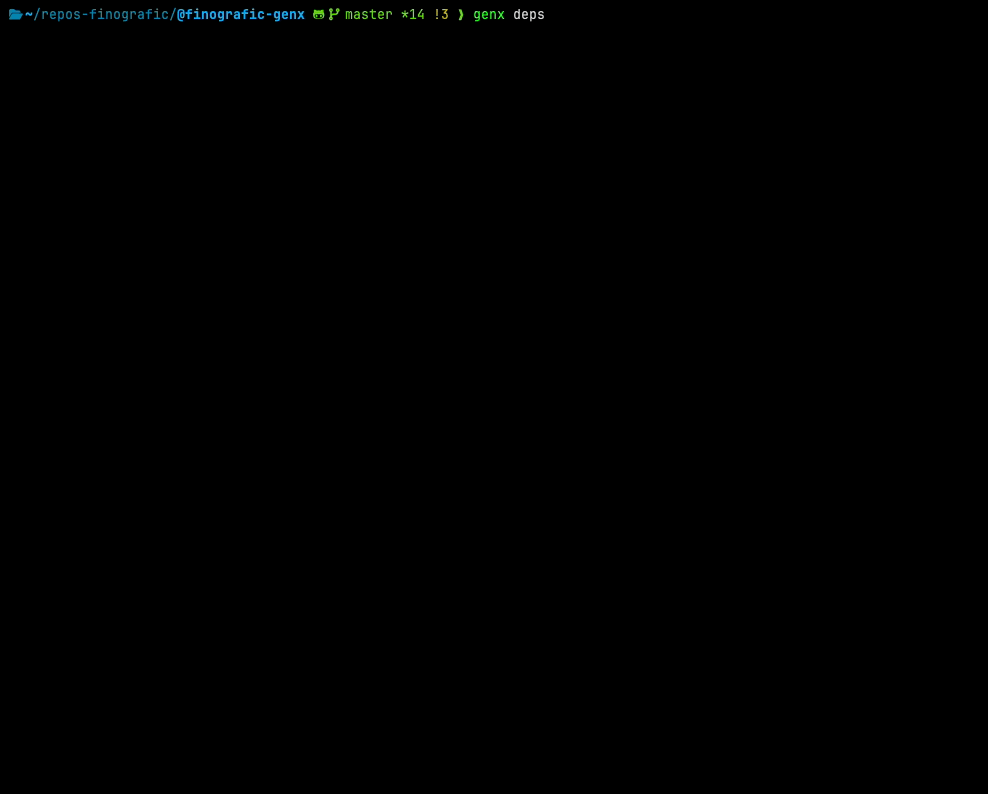

# 🦋 @finografic/genx

> Opinionated generator and codemod toolkit for the **@finografic** ecosystem.

This package provides a small CLI for:

- scaffolding new `@finografic` packages
- applying conventions (e.g. TypeScript) to existing repositories
- keeping project structure **consistent, minimal, and explicit**

It is designed to be **run**, not installed.

---

## 🚀 Usage

<!-- GENERATED:USAGE:START -->

Run directly using `pnpm dlx`:

```bash
pnpm dlx @finografic/genx <command> [options]
```

| Command   | Description                                        |
| --------- | -------------------------------------------------- |
| `create`  | Scaffold a new @finografic package                 |
| `upgrade` | Upgrade an existing package to current conventions |
| `deps`    | Sync dependencies to @finografic/deps-policy       |
| `audit`   | Scan features and apply what is missing or partial |
| `managed` | Run a command across all managed targets           |
| `help`    | Show this help message                             |

### `genx create`

Create a new @finografic package from template

```bash
genx create [options]
```

| Flag            | Description                       |
| --------------- | --------------------------------- |
| `--type <type>` | Package type (see below)          |
| `--name <name>` | Package name (@finografic/...)    |
| `-y, --yes`     | Accept defaults without prompting |

**Examples:**

```bash
# Create a new package interactively
genx create

# Create a CLI package
genx create --type cli

# Create a library with a specific name
genx create --type library --name my-lib

# Create a shared config package
genx create --type config

# Create a Vite + React app
genx create --type react
```

**PACKAGE TYPES:**

| Type      | Description                   |
| --------- | ----------------------------- |
| `library` | reusable TypeScript library   |
| `cli`     | command-line tool             |
| `config`  | shared configuration package  |
| `react`   | Vite + React + TypeScript app |

**How it works:**

1. Prompts for package type, name, author, and optional features
2. Copies _templates/ into the target directory with variable substitution
3. Applies selected features (oxc-config, git-hooks, etc.)
4. Runs pnpm install and initializes a git repository

### `genx upgrade`

Upgrade an existing @finografic package to current conventions

```bash
genx upgrade [path] [options]
```

| Flag        | Description                        |
| ----------- | ---------------------------------- |
| `-y, --yes` | Skip per-file confirmation prompts |

**Examples:**

```bash
# Upgrade current directory interactively
genx upgrade

# Upgrade a specific directory
genx upgrade ../my-package

# Apply changes without per-file confirms
genx upgrade --yes
```

**How it works:**

1. Select upgrade operations (package.json, gitignore, config, agent docs, etc.)
2. Optionally select features to apply alongside the upgrade
3. Shows a diff preview for each changed file before writing
4. Applies selected changes to the target directory

### `genx deps`

Sync package dependencies to @finografic/deps-policy



```bash
genx deps [path] [options]
```

| Flag                | Description                                 |
| ------------------- | ------------------------------------------- |
| `-y, --yes`         | Apply all planned changes without prompting |
| `--allow-downgrade` | Include policy downgrades in the plan       |
| `--update-policy`   | Update deps-policy itself (no dep sync)     |

**Examples:**

```bash
# Interactive sync in current directory
genx deps

# Sync deps for a specific directory
genx deps ../my-package

# Apply all changes non-interactively
genx deps --yes

# Include downgrades when planning
genx deps --allow-downgrade

# Update @finografic/deps-policy
genx deps --update-policy
```

**How it works:**

1. Reads policy versions from @finografic/deps-policy
2. Compares against local package.json dependencies
3. Shows a table of planned upgrades and downgrades for installed dependencies
4. Prompts to select packages (or applies all with --yes)
5. Runs pnpm install and syncs toolchain versions (.nvmrc, engines, packageManager)

### `genx audit`

Scan features and apply what is missing or partial

```bash
genx audit [path] [options]
```

| Flag        | Description                                       |
| ----------- | ------------------------------------------------- |
| `-y, --yes` | Apply selected features without per-file confirms |

**Examples:**

```bash
# Audit current directory
genx audit

# Audit a specific directory
genx audit ../my-package

# Apply without per-file confirms
genx audit -y
```

**How it works:**

1. Scans all known features against the target package
2. Reports installed, partial, and missing features
3. Prompts to select partial/missing features to apply
4. Applies selected features with diff preview

### `genx managed`

Run a command across all managed targets

```bash
genx managed <command> [options]
```

| Subcommand | Description                                           |
| ---------- | ----------------------------------------------------- |
| `upgrade`  | Upgrade managed targets to current conventions        |
| `deps`     | Sync deps across managed targets                      |
| `audit`    | Audit and repair feature state across managed targets |

| Flag                | Description                                                             |
| ------------------- | ----------------------------------------------------------------------- |
| `-y, --yes`         | Skip per-target and per-file confirms; audit still prompts for features |
| `--features=KEYS`   | Comma-separated feature keys to apply (managed audit only)              |
| `--allow-downgrade` | Include downgrades (deps only)                                          |
| `--update-policy`   | Refresh deps-policy before syncing (deps only)                          |

**Examples:**

```bash
# Upgrade all managed targets
genx managed upgrade

# Sync deps for all managed targets
genx managed deps

# Refresh deps-policy, then sync all managed targets
genx managed deps --update-policy

# Sync deps non-interactively
genx managed deps --yes

# Audit each target and choose features per project
genx managed audit

# Apply AI Memory repairs where needed
genx managed audit --features=ai-memory

# Apply selected feature repairs where needed
genx managed audit --features=ai-memory,vitest

# Audit each target; skip apply/file confirms
genx managed audit -y
```

**How it works:**

1. Reads managed targets from ~/.config/finografic/genx.config.jsonc
2. Runs the selected command (upgrade, deps, or audit) on each target
3. Managed deps uses the current policy snapshot unless --update-policy is passed
4. Managed audit scans all targets first, then prompts for feature selection per target
5. Managed audit --features=KEYS skips feature selection and applies only matching partial/missing features
6. Feature keys match src/features/* folder names, e.g. ai-memory, git-hooks, react-vite

<!-- GENERATED:USAGE:END -->

---

## ✨ Features

<!-- GENERATED:FEATURES:START -->

### AI Agents (AGENTS.md + skills)

Scaffolds and syncs the agent interface layer of a `@finografic` project.

- Creates `AGENTS.md` from the canonical template if absent
- Merges existing `AGENTS.md`: enforces template bodies, strips legacy memory sections, dedupes duplicate Markdown Tables headings, and reorders sections (front matter → Rules spine → extras → Learned)
- Keeps enforced shared sections in sync with the template: **Project Memory Model**, **Roadmap and Planning Docs**, **Rules — Global**, **Rules — Markdown Tables**, and **Git Policy**
- Seeds **Rules — Project-Specific** once (never overwritten — project customises it)
- Copies portable agent skill procedures into `.github/skills/`
- Adds `scaffold-cli-help` and `scaffold-core-module` only for CLI package types
- Removes the genx-only `scaffold-feature` skill from generated targets

### ai-instructions

Shared AI tooling instructions for GitHub Copilot, Cursor, and Claude Code.

- Syncs `.github/copilot-instructions.md` from `_templates` (full file when content differs).
- Syncs each file under `.github/instructions/` from `_templates`, **except** the `project/` subtree — that folder is never overwritten by genx (per-repo rules stay put).
- Syncs `.cursor/rules/*.mdc` from `_templates` (always-on Cursor rules that point at `AGENTS.md` and `.github/instructions/`).
- Syncs **`AGENTS.md`** with **reverse apply** from **`_templates/AGENTS.md.template`** (canonical spine: **Rules — Project-Specific** → **Rules — Global** → **Rules — Markdown Tables** → **Git Policy** → **Cursor**, plus shared bodies for General / Markdown / Git / Cursor). The target supplies **Rules — Project-Specific** body and any extra `##` sections; those land **after** the spine (merge order), with **Learned** last. Treat that template file as the spec — not the genx repo’s root `AGENTS.md`. Missing file: write the full template.

### ai-memory

Project memory model for agentic coding workflows.

- `docs/process/PROJECT_MEMORY_MODEL.md`
- `docs/todo/ROADMAP.md` with a `## Next` section
- `.agents/handoff.md`
- `.agents/memory.md`
- `AGENTS.md` Project Memory Model block (via `ai-agents` dependency)
- `.gitignore` rules for tracked handoff + ignored memory
- minimal `CLAUDE.md` pointer to `AGENTS.md`
- migration from legacy `.claude/memory.md` and `.claude/handoff.md`, followed by legacy-file deletion
- migration from legacy `docs/todo/NEXT_STEPS.md` into `ROADMAP.md#next`, followed by legacy-file deletion

### css

CSS/SCSS formatting via oxfmt with CSS-aware overrides.

- Configures oxfmt (oxc) as the default formatter for `css` and `scss`
- Patches `oxfmt.config.ts`: adds `css` import and `{ files: ['*.css', '*.scss'], options: { ...css } }` when missing (standard genx layout)
- Renders CSS/SCSS formatter blocks through the shared grouped `.vscode/settings.json` model

### git-hooks

Pre-commit linting + conventional commits.

- Installs `lint-staged`, `husky`
- Installs `@commitlint/cli`, `@commitlint/config-conventional`
- Adds `lint-staged` config to package.json (`*.{ts,tsx,js,jsx,mjs,cjs}` → `oxfmt` then `oxlint --fix`)
- Scaffolds `.husky/pre-commit` and `.husky/commit-msg`
- Ensures `commitlint.config.mjs` exists (copies from genx `_templates/` when missing)
- Removes an inlined `commitlint` key from package.json if present (config lives in `commitlint.config.mjs`)
- Removes legacy `simple-git-hooks` config/files when present
- Ensures `prepare` script runs `husky`

### markdown

Markdown linting via `@finografic/md-lint`.

- Installs `@finografic/md-lint`
- Splits a combined `*.{json,…,md}` lint-staged glob into data-only + `*.md` with `md-lint --fix`
- Ensures `.markdownlint.jsonc` extends `node_modules/@finografic/md-lint/.markdownlint.jsonc`
- Removes deprecated inline `markdownlint.config` from `.vscode/settings.json`
- Adds VSCode extension recommendation
- Migrates old preview-style paths and removes deprecated copied CSS assets from `.vscode/`
- Renders `.vscode/settings.json` through the shared grouped settings model

### oxc-config

Migrate an existing package to `@finografic/oxc-config` + `oxfmt` + `oxlint` (for repos not created from the latest genx template).

- Installs `oxfmt`, `oxlint`, `oxlint-tsgolint`, and `@finografic/oxc-config`
- Removes legacy `@finografic/oxfmt-config` if present
- Creates `oxfmt.config.ts` (base preset; CSS overrides come from the **css** feature)
- Writes a minimal `oxlint.config.ts` using the inferred package-type preset from `@finografic/oxc-config/oxlint`
- Ensures `lint` / `lint:fix` / `lint:ci` scripts use oxlint
- Creates or updates `update:oxc-config` in the **PACKAGES** scripts section
- Ensures `format:check` / `format:fix` scripts use oxfmt
- Removes legacy update scripts (`update:eslint-config`, `update:oxfmt-config`)
- Replaces Prettier if present (uninstall + remove configs)
- Normalizes `lint-staged`: code → `oxfmt` then `oxlint --fix`; `*.md` → `oxfmt` then `oxlint --fix`; data files → `oxfmt` only
- Adds format check to `release:check` / CI when missing
- Recommends `oxc.oxc-vscode` in `.vscode/extensions.json`
- Removes legacy `dbaeumer.vscode-eslint` / `dprint.dprint` recommendations from `.vscode/extensions.json`
- Writes canonical grouped `.vscode/settings.json` (oxc formatter, ordered language blocks, oxc/typescript preferences)
- Removes associated legacy `eslint` / `dprint` dependencies and root config files
- Removes legacy `dprint` format-check steps from `.github/workflows/ci.yml`

### React + Vite

Ensures a Vite + React + TypeScript app surface is fully configured with Panda CSS, `@finografic/design-system`, and path aliases.

- Ensures `react`, `react-dom`, `@finografic/design-system`, and `@finografic/icons` are in `dependencies`
- Ensures `vite`, `@vitejs/plugin-react`, `@pandacss/dev`, `concurrently`, and React type packages are in `devDependencies`
- Creates `vite.config.ts` with React plugin and path aliases when missing
- Creates `panda.config.ts` with design-system preset when missing
- Creates `postcss.config.mjs` with Panda CSS plugin when missing
- Creates `src/vite-env.d.ts`, `src/main.tsx`, and `src/App.tsx` when missing

### vitest

Testing via Vitest.

- Installs `vitest`
- Adds `test` / `test:run` / `test:coverage` scripts

<!-- GENERATED:FEATURES:END -->

---

## 📦 What's Included

Every scaffolded package includes:

- `package.json` — configured with scope, name, and package type
- `tsconfig.json` — strict TypeScript config
- `tsdown.config.ts` — modern bundler setup
- `oxfmt.config.ts` — oxfmt formatting config
- `.gitignore`, `LICENSE`, `README.md`

Baseline features installed during `create`:

- **oxc-config** — migrate older repos to oxfmt + oxlint + `@finografic/oxc-config`
- **markdown** — markdown linting via `@finografic/md-lint`

Optional features (selected during `create`, selected during `upgrade`, or repaired via `audit`):

- **vitest** — unit testing
- **git-hooks** — pre-commit linting + conventional commits
- **ai-agents** — `AGENTS.md` sync + portable skills
- **ai-instructions** — shared AI rules (Copilot, Cursor, Claude)
- **ai-memory** — roadmap, handoff, and session memory model
- **css** — CSS/SCSS formatting via oxfmt
- **react-vite** — Vite + React + TypeScript + Panda CSS app surface

---

## 🏗️ Generated Structure

```
my-package/
├── src/
│   ├── index.ts
│   └── cli.ts              (cli type only)
├── package.json
├── tsconfig.json
├── tsdown.config.ts
├── oxfmt.config.ts
├── .gitignore
├── LICENSE
├── README.md
└── .github/                 (optional)
    ├── copilot-instructions.md
    └── instructions/
```

---

## 📋 Commands Reference

<!-- GENERATED:COMMANDS_REF:START -->

| Command         | Description                                        | Options                                                                                     |
| --------------- | -------------------------------------------------- | ------------------------------------------------------------------------------------------- |
| `create`        | Scaffold a new @finografic package                 | `--type <type>`, `--name <name>`, `-y`                                                      |
| `upgrade`       | Upgrade an existing package to current conventions | `-y`                                                                                        |
| `deps`          | Sync dependencies to @finografic/deps-policy       | `-y`, `--allow-downgrade`, `--update-policy`                                                |
| `audit`         | Scan features and apply what is missing or partial | `-y`                                                                                        |
| `managed`       | Run a command across all managed targets           | `upgrade`, `deps`, `audit`, `-y`, `--features=KEYS`, `--allow-downgrade`, `--update-policy` |
| `help`          | Show this help message                             | -                                                                                           |
| `--help` / `-h` | Show help (works with commands too)                | -                                                                                           |

See `genx <command> --help` for detailed usage.
<!-- GENERATED:COMMANDS_REF:END -->

---

## 🛠️ Development

```bash
git clone https://github.com/finografic/genx.git
pnpm install
pnpm build
pnpm test:run
```

### Testing the CLI locally

Link globally (recommended — rebuilds take effect immediately):

```bash
pnpm link
genx create
genx upgrade --help

# When done:
pnpm unlink
```

Or run the built binary directly: `node dist/index.mjs create`

### Documentation

- [Developer Workflow](./docs/DEVELOPER_WORKFLOW.md)
- [Release Process](./docs/RELEASES.md)
- [GitHub Packages Setup](./docs/GITHUB_PACKAGES_SETUP.md)

---

## License

MIT © [Justin Rankin](https://github.com/finografic)
